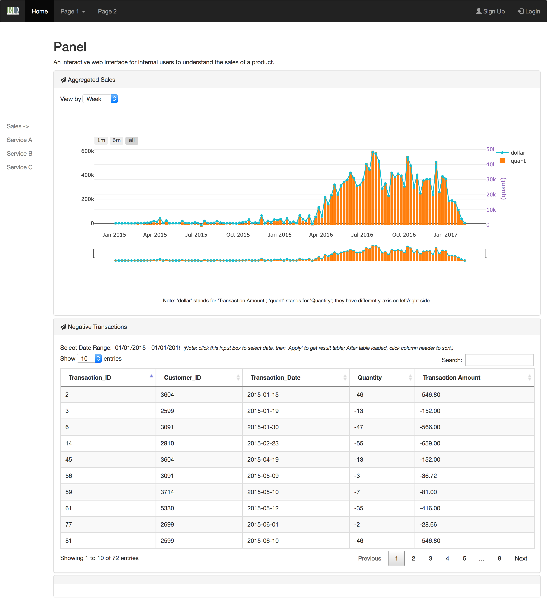

# python_sales

An interactive web interface for internal users to understand the sales of a product.

## Stack
### Front_end
* Bootstrap
* JQuery
* Plottly
* ajax

### Back_end
* Flask
* Pandas

## Install
- python3
- use pip or pipenv to install latest flask, pandas, xlrd, plotly

## Run Locally
- `cd myPipenv`
- `python3 main.py`

## Run Online
I've setup the enviroment and post it online at: [http://bit.ly/rdlegal2018](http://bit.ly/rdlegal2018)

